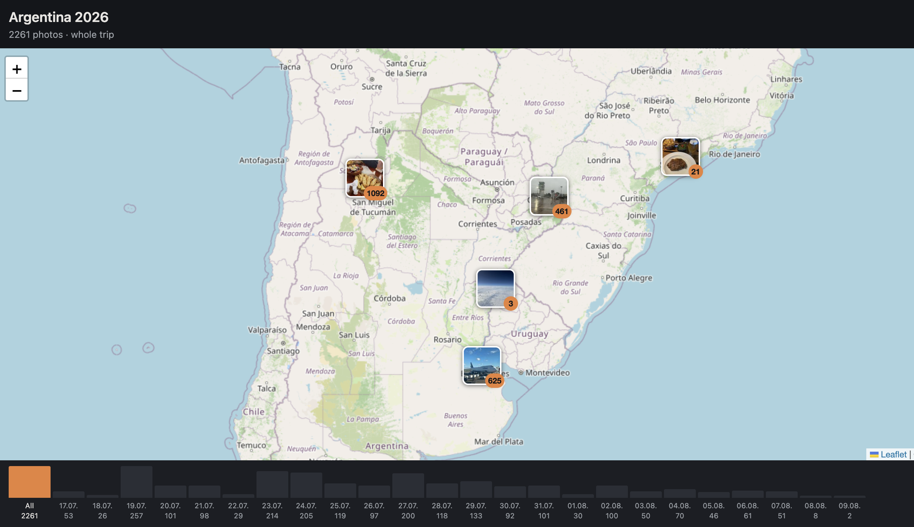

# fototrip

Turns a folder of geotagged photos into a self-contained static website: an
OpenStreetMap map with thumbnail markers that cluster when you zoom out, a
lightbox with next/prev, and a day-by-day time axis that filters the map.

No API key, no CDN, no JavaScript build step. The output is a directory you can
copy onto any web server.



## Requirements

Python 3.13 or newer.

Filling a folder from Photos.app is macOS-only and needs
[osxphotos](https://github.com/RhetTbull/osxphotos) and `exiftool`
(`brew install exiftool`).

## Install

```bash
git clone https://github.com/lackas/fototrip
cd fototrip
python3 -m venv .venv
source .venv/bin/activate
pip install -e .              # add ".[album]" for the Photos.app export
```

## Use

```bash
fototrip build trip -o site --title "My Trip"
fototrip serve site
```

`build` flags: `-o/--out` (default `site`), `--title` and `--subtitle`
(override `trip.toml` and the folder name), `--thumb-px` (default 96, the
square marker thumbnail), `--web-px` (default 1600, the long-edge cap on the
lightbox image), `--no-geocode` and `--places-cache`. `serve` takes
`-p/--port` (default 8000).

Copy `site/` anywhere that serves files. `site/.fototrip-cache.json` is build
metadata and does not need to go with it.

With several trips under one folder, `fototrip index <folder>` writes an
overview page listing and linking to each of them. The trips reference
everything relatively, so a web server pointed at the folder serves the
overview and the trips together, with no configuration and nothing running.
[deploy/](deploy/) has a worked example with Caddy.

Builds are incremental, so re-running after adding photos only processes what
changed. Changing `--thumb-px` or `--web-px` rebuilds every derivative.

A photo's day comes from its coordinates rather than from its EXIF UTC offset,
so a camera left on the wrong timezone still lands on the right day.

Optional `trip.toml` in the photo folder, overridden by the CLI flags:

```toml
title = "My Trip"
subtitle = "where it went"
tile_url = "https://{s}.tile.openstreetmap.org/{z}/{x}/{y}.png"
tile_attribution = '&copy; <a href="https://www.openstreetmap.org/copyright">OpenStreetMap</a> contributors'
```

`tile_url` and `tile_attribution` default to OpenStreetMap.

## Place names

The lightbox shows each photo's date, local time and a readable place —
"Cataratas del Iguazú, Puerto Iguazú, Argentinien" rather than coordinates.

Names come from OpenStreetMap's Nominatim at build time, so the published site
still makes no third-party requests. Lookups are rate-limited to one per
second and cached in `~/.cache/fototrip/places.json`, outside the output
folder, so `rm -rf site` does not throw them away. Move the cache with
`--places-cache PATH`; it stores rounded coordinates only. Coordinates are
rounded to about 110 m before lookup, which collapses a few hundred photos
into a few dozen requests.

Without a network you get a site without place names and the next build fills
them in. `--no-geocode` turns it off.

## Filling the folder from Photos.app

`export-album` fills a trip folder from a Photos.app album:

```bash
fototrip export-album "My Album" -o trip --expect 2500 --replace
```

Photos are converted to JPEG and carry their capture time and, where the
library knows it, their GPS coordinates. This is what makes it worth doing for
an iCloud Shared Album: Apple strips GPS from the file it hands out, but the
library still has the location.

One album photo becomes one file. Videos, live-photo motion files, burst
frames other than the keeper, the RAW half of a RAW+JPEG pair and the unedited
original of an edited photo are all skipped.

The library is only ever read.

`--replace` is required to write into a folder that is not empty. The export
is staged in `<folder>.incoming/` first, and an export that fails, produces
nothing or writes fewer files than its run report claimed leaves your folder
untouched. If the process is killed during the final swap, your photos are in
`<folder>.previous/` and the next run refuses to start until you have dealt
with it.

`--expect N` sharpens the free-space check and adds the album's size to the
report. Without it the export still refuses below a free-space floor, and
still refuses to replace anything when it produced no photos or fewer than its
run report claimed.

## Duplicates

Re-adding pictures to a shared album creates fresh assets, so an export can
hand out the same frame twice under different names. The build drops the extra
copies and reports them:

```
2 skipped:
      2  the same photo twice
```

Two photos count as the same only when their local capture time, coordinates
and image content all agree, so a burst of different shots at one instant is
kept. The larger file is the one published.

## Known limits

- Videos (`.mov`) are ignored.
- Photos without GPS coordinates or without a timestamp are skipped. The build
  reports how many and why.
- The site embeds every photo's exact coordinates, so anyone with the URL has
  the trip's GPS track.

## Development

```bash
pip install -e ".[dev]"
playwright install chromium   # once, for the browser tests
pytest
pytest -k frontend            # the Playwright tests
ruff format src tests
```

`tools/vendor_assets.py` re-downloads the pinned frontend libraries into
`src/fototrip/assets/vendor/` and refreshes `VENDOR.lock.json`. The vendored
files are committed, so builds need no network.

## License

MIT. See [LICENSE](LICENSE).
